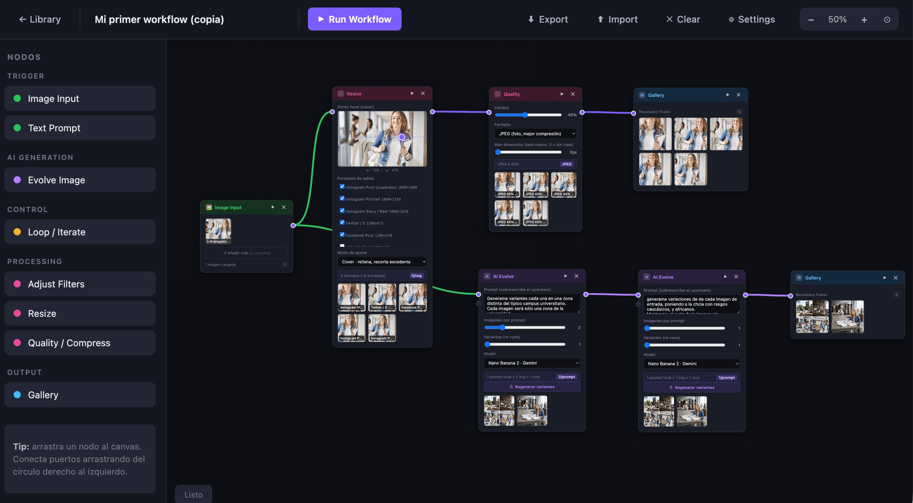
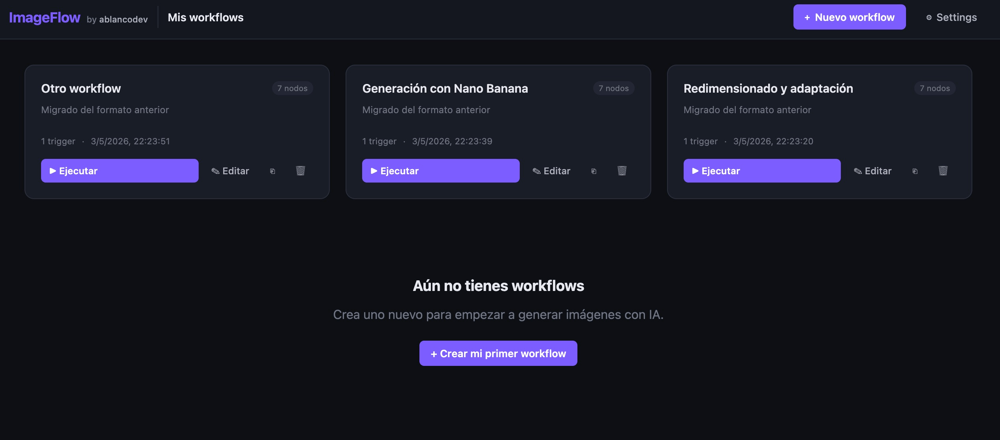
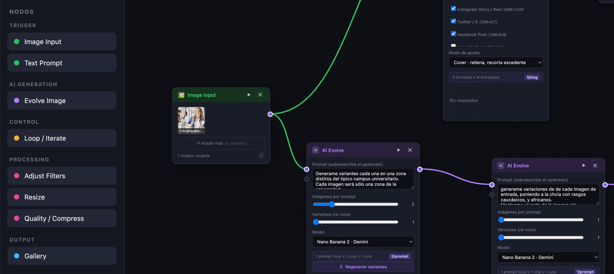
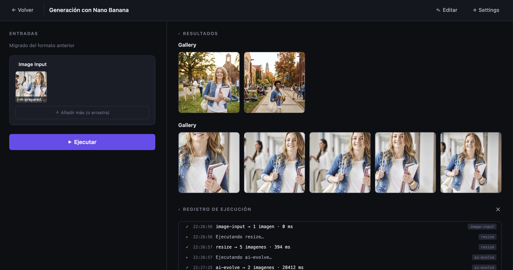
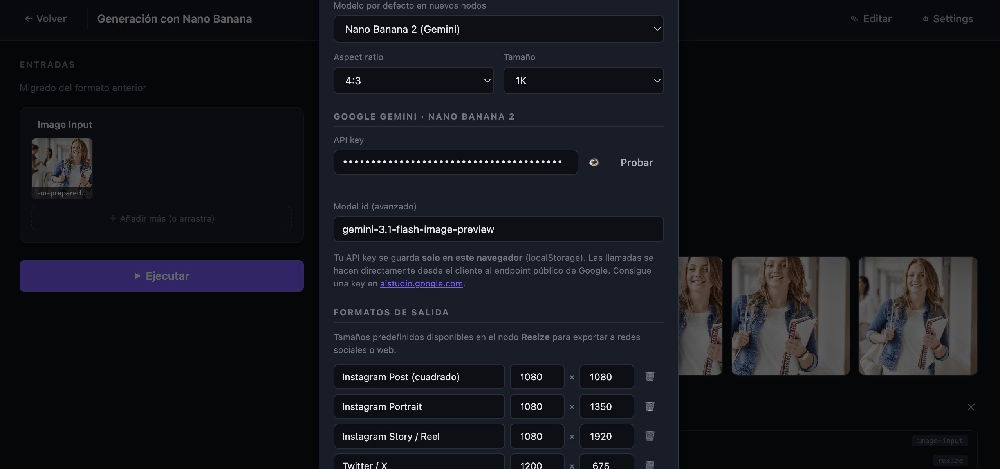

# 🖼 ImageFlow

> Editor visual de workflows para generar, evolucionar y exportar imágenes con IA — sin build steps, sin servidores, sin npm install. Solo abre el `index.html` y arrastra nodos.

<p align="center">
  
</p>

<p align="center">
  <a href="#-qué-es-esto">¿Qué es?</a> ·
  <a href="#-por-qué-existe">¿Por qué?</a> ·
  <a href="#-cómo-funciona">Cómo va</a> ·
  <a href="#-empezar-en-30-segundos">Empezar</a> ·
  <a href="#-hoja-de-ruta">Roadmap</a>
</p>

<p align="center">
  
  
  
  
  
</p>

---

## 👋 ¿Qué es esto?

**ImageFlow** es un editor de workflows tipo nodos (a lo ComfyUI / n8n / Blender Geometry Nodes) pero **enfocado en la vida real del que crea imágenes a diario**: pillar una foto, evolucionarla con IA, sacar 5 variantes, mandarlas por un loop, ajustar filtros, redimensionar a los 8 formatos de redes que pide el cliente, y exportar.

Todo en una página HTML estática. Tu API key se guarda **solo en tu navegador**. No hay backend. No hay tracking. No hay "regístrate con tu email".

> Está pensado para que sea idiot-proof y extensible: añadir un nodo nuevo son ~30 líneas en `js/nodes.js`.

---

## 🤔 ¿Por qué existe?

Soy **[ablancodev](https://ablancodev.com)**, desarrollador freelance. Y como cualquier freelance, me paso media vida:

- Generando imágenes para landings, blogs, redes y mockups.
- Reexportando lo mismo a 1080×1080, 1080×1350, 1200×630, 1280×720, 1920×1080…
- Pidiéndole a la IA "dame 3 variantes pero más cinemáticas".
- Repitiendo todo eso para el siguiente cliente. Y el siguiente.

Las herramientas que existen son o muy potentes y complejas (ComfyUI, A1111) o muy SaaS y caras. Quería algo **mío**, ligero, que abriera con doble clic, con la lógica de pipeline que tengo en la cabeza.

> **Hecho para mi flujo de freelance** — pero perfectamente válido para una agencia que quiera plantillas de generación reutilizables, o para extenderlo con tus propios nodos (vídeo, audio, OCR, lo que se te ocurra).

---

## ✨ Features

- 🧩 **Editor visual de nodos** con drag & drop, zoom, pan y conexiones tipo Bézier.
- 🤖 **Integración con Google Gemini (Nano Banana 2)** para generación y *image-to-image*.
- 🎲 **Modo Mock** (sin API key) — genera imágenes proceduralmente con `<canvas>` para que puedas trastear el flujo sin gastar tokens.
- 🔁 **Loops / iteraciones** con feedback edges para refinar resultados.
- 🎛 **Filtros nativos** (brillo, contraste, saturación, hue, blur) ejecutados en canvas — instantáneos.
- 📐 **Resize multi-formato** con presets para Instagram, Twitter, LinkedIn, YouTube, Pinterest… (todos editables).
- 💾 **Biblioteca de workflows** persistida en `localStorage` + import/export a JSON.
- 🌱 **Semillas deterministas**: re-ejecutar un workflow sin cambios produce las mismas imágenes. Solo se regenera lo que cambió.
- 🪶 **Cero dependencias.** Cero `node_modules`. Cero build. Un `index.html` y a correr.

---

## 📸 Cómo se ve

### Biblioteca de workflows
<p align="center">
  
</p>

### Editor — el patio de juegos
<p align="center">
  
</p>

### Runner — para ejecutar sin tocar el grafo
<p align="center">
  
</p>

### Settings — API key, formatos, modelos
<p align="center">
  
</p>

---

## 🧱 Cómo funciona

Un workflow es un **DAG** (grafo dirigido) con nodos de varios tipos. ImageFlow hace un *topological sort*, ejecuta cada nodo en orden, y propaga los outputs (imágenes o prompts) por los edges. Los ciclos los maneja el nodo `Loop` iterando internamente.

```
[Image Input] ──▶ [AI Evolve] ──▶ [Filters] ──▶ [Resize] ──▶ [Gallery]
                       ▲
[Text Prompt] ─────────┘
```

### Nodos disponibles

| Grupo | Nodo | Qué hace |
|---|---|---|
| **Trigger** | 🖼 Image Input | Sube imágenes desde tu disco |
| **Trigger** | ✎ Text Prompt | Define el prompt textual |
| **AI** | ✦ AI Evolve | Genera variantes (Gemini Nano Banana 2 o Mock) |
| **Control** | ↻ Loop | Itera N veces sobre un nodo upstream |
| **Processing** | ◐ Filters | Brillo, contraste, saturación, hue, blur |
| **Processing** | ▢ Resize | Exporta a presets (Instagram, X, LinkedIn…) |
| **Processing** | ◇ Quality | JPEG/PNG/WebP con control de calidad y tamaño máximo |
| **Output** | ▤ Gallery | Visualiza, descarga y regenera resultados |

### Añadir un nodo nuevo
Echa un ojo a `js/nodes.js`. La estructura `TYPES` es declarativa: defines `inputs`, `outputs`, `defaultData`, `render` y listo. Si la lógica de ejecución no es trivial, también un handler en `js/workflow.js`.

---

## 🚀 Empezar en 30 segundos

```bash
# 1. Clona
git clone https://github.com/ablancodev/imageflow.git
cd imageflow

# 2. Abre. En serio, eso es todo.
open index.html        # macOS
xdg-open index.html    # Linux
start index.html       # Windows
```

> ¿Quieres usar la IA real (Gemini Nano Banana 2)?
> 1. Pilla una API key gratis en [aistudio.google.com](https://aistudio.google.com/app/apikey).
> 2. Ábrela en ImageFlow → ⚙ Settings → pégala → "Probar".
> 3. Cambia el modelo del nodo `AI Evolve` de "Mock" a "Nano Banana 2".

Tu key vive en `localStorage`. **Nunca sale de tu navegador.** Las llamadas van directas al endpoint público de Google.

### ¿Y si lo quiero servir desde XAMPP / un server local?
Funciona también. Es HTML+JS estático, lo puedes meter detrás de Apache, Nginx, GitHub Pages, Vercel o lo que quieras. **No hay backend, no hay build.**

---

## 🛠 Stack

- HTML + CSS + Vanilla JS (ES2020)
- `<canvas>` para todo el procesado de imagen del lado cliente
- `localStorage` para persistir workflows y settings
- Google Gemini API para generación con IA (opcional)
- ✨ Cero `package.json`. Cero `webpack.config`. Cero `tsconfig`. Cero `.eslintrc`. Cero excusas.

---

## 🗺 Hoja de ruta

Esto es lo que tengo en mente, en orden de "me apetece más" a "ya veremos":

- [ ] Más providers de IA: OpenAI Images, Stable Diffusion local, Replicate
- [ ] Nodos de **vídeo** (extraer frames, generar GIF, recortar)
- [ ] Nodo de **upscale** (Real-ESRGAN vía API)
- [ ] Nodo de **OCR / extracción de texto** para automatizar mockups
- [ ] Nodo de **batch CSV** — alimenta un workflow con una lista de prompts
- [ ] Templates de workflow compartibles vía URL
- [ ] Modo agencia: workspaces, branding por cliente, exportación masiva ZIP
- [ ] PWA / instalable como app nativa

¿Se te ocurre uno? **Abre un issue** y lo charlamos.

---

## 🤝 Contribuir

Esto es un proyecto personal pero abierto a la peña. Si te apetece:

1. **Issues**: bugs, ideas, "oye y si…"
2. **PRs**: añadir un nodo nuevo es la forma más fácil de contribuir. La arquitectura está pensada para que sea trivial.
3. **Forks**: úsalo para tu agencia, tu producto, tu cliente. La licencia lo permite.

No hay CONTRIBUTING.md aún porque somos pocos. Si esto crece, lo escribimos.

---

## 📁 Estructura del repo

```
imageflow/
├── index.html              ← punto de entrada único
├── css/
│   └── style.css           ← todos los estilos
├── js/
│   ├── app.js              ← bootstrap
│   ├── views.js            ← library / editor / runner
│   ├── canvas.js           ← zoom, pan, grid
│   ├── nodes.js            ← definición de tipos de nodo + render
│   ├── connections.js      ← edges entre nodos (SVG)
│   ├── workflow.js         ← motor de ejecución (topo-sort, loops)
│   ├── workflows.js        ← biblioteca + persistencia
│   ├── imagegen.js         ← Gemini + generador mock
│   ├── settings.js         ← settings + localStorage
│   └── logger.js           ← log de ejecución del runner
└── docs/screenshots/       ← imágenes para este README
```

---

## 📜 Licencia

MIT — haz lo que quieras, pero no me hagas responsable si tu cliente te pide 47 variantes el viernes a las 8 de la tarde.

---

## 🙋 Sobre mí

Soy **Antonio Blanco** — desarrollador freelance, [ablancodev.com](https://ablancodev.com).

Si ImageFlow te ahorra una tarde, dale a la ⭐ del repo. Si te ahorra una semana, tweetéamelo. Si revoluciona tu agencia, invítame a un café ☕.

<sub>Hecho con cariño y demasiado café entre clientes.</sub>
